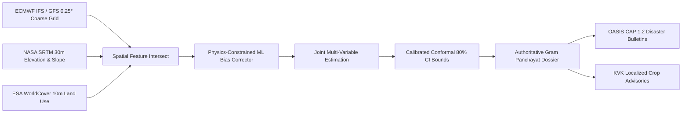

# 🌾 GramMausam (SIH26074)
### Cadastral-Scale Agrometeorological AI Downscaling & Hyperlocal Early Warning Engine

[](https://sih.gov.in)
[](http://127.0.0.1:8000/docs)
[](http://localhost:5173)
[](#-disaster-alert-engine-oasis-cap-12)
[](#-critical-spatial-mandate)
[](#-test-suite--quality-verification)

> **Official Problem Statement:** *"Downscaling of weather forecast from Block level to Panchayat level: Inferring high-resolution plots/data/information from low-resolution plot/data/information/variables for agro-meteorological advisory services."* — **Ministry of Panchayati Raj / IMD Agromet**

---

## ⚡ Interactive Quick Navigation

<div align="center">

| [🗺️ Live Dashboard](#-5-screen-interactive-dashboard) | [🧠 AI Downscaling](#-physics-informed-ml-downscaling-engine) | [🚨 OASIS CAP Alerts](#-disaster-alert-engine-oasis-cap-12) |
| :---: | :---: | :---: |
| **[📊 Verification Ladder](#-scientific-honesty--the-verification-ladder)** | **[🔌 REST API Matrix](#-rest-api-specification)** | **[🚀 Instant Launch](#-instant-launch-guide)** |

</div>

---

## 🏛️ Critical Spatial Mandate

```
╔══════════════════════════════════════════════════════════════════════════════════════════════╗
║                                  SPATIAL ARCHITECTURE DIRECTIVE                             ║
║             THE GRAM PANCHAYAT POLYGON IS THE PRIMARY SPATIAL UNIT OF THE SYSTEM             ║
╠══════════════════════════════════════════════════════════════════════════════════════════════╣
║ ❌ NEVER treat coarse NWP grid boxes (0.25° ~25km / 0.1° ~9km) as Panchayats.                ║
║ ❌ NEVER substitute arbitrary grid centroids or random points for administrative boundaries.  ║
║ ❌ NEVER display unverified numbers as authoritative ground truth.                          ║
║                                                                                              ║
║ ✅ Every prediction, risk index, SHAP factor, tabular number, and advisory bulletin is       ║
║    strictly bound to an AUTHORITATIVE LOCAL GOVERNMENT DIRECTORY (LGD) CADASTRAL POLYGON.    ║
╚══════════════════════════════════════════════════════════════════════════════════════════════╝
```

---

## 🖥️ 5-Screen Interactive Dashboard

The frontend ([`frontend/`](frontend/)) is built with **React 18, TypeScript, and Vite**, incorporating Sanket-style high-density operational aesthetics, dark mode `#0b1220` tokens, and accessible WCAG 2.1 AA tabular views.

```
┌─────────────────────────────────────────────────────────────────────────────────────────────┐
│ 🌾 GramMausam Operations · ALL INDIA · 603 PILOT PANCHAYATS · DAY 1                        │
├─────────────────────────────────────────────────────────────────────────────────────────────┤
│  [ Operations ]   [ Alerts (CAP 1.2) ]   [ Model Evidence ]   [ Replay ]   [ Methodology ]  │
├─────────────────────────────────────────────────────────────────────────────────────────────┤
│  10-Day Scrubber:  [D1]  [D2]  [D3]  [D4: PEAK]  [D5]  [D6]  [D7]  [D8]  [D9]  [D10]      │
│                                                                                             │
│  ┌───────────────────────────────┐ ┌─────────────────────────────────────────────────────┐  │
│  │ 🗺️ TopoJSON Choropleth Map     │ │ 📋 Panchayat Dossier (e.g. Sanwer LGD #133203)     │  │
│  │                               │ │  • Peak Risk Horizon: ALERT 78% (Day 4)             │  │
│  │ • 666 District Boundaries     │ │  • What Drives Risk (SHAP): Precip +28%, Slope +16% │  │
│  │ • Claimed Territory Insets    │ │  • Downscaled vs Coarse Recharts Curve              │  │
│  │ • 1,471 Cadastral Polygons    │ │  • Red "Panchayat Effect" Delta Line                │  │
│  │ • Risk / Variable Modes       │ │  • ICAR-KVK Directives with Text-to-Speech          │  │
│  └───────────────────────────────┘ └─────────────────────────────────────────────────────┘  │
└─────────────────────────────────────────────────────────────────────────────────────────────┘
```

<details open>
<summary><b>🔍 Explore the 5 Specialized Operational Views</b></summary>

### 1. Operations (`/`)
- **National Picture & 10-Day Rail:** Real-time synchronized scrubber across lead-times $D+1$ to $D+10$.
- **High-Density TopoJSON Choropleth:** Zero-latency client-side SVG rendering of all 666 Indian districts and cadastral polygons.
- **Panchayat Dossier & Panchayat Effect:** Click any village to inspect its 6-factor SHAP gradient decomposition, elevation cross-section, and downscaling departure ($\Delta = \text{Downscaled} - \text{Coarse}$).
- **Text-to-Speech Agronomic Directives:** Native Web Speech API audio playback in Hindi and English.

### 2. Alerts (`/?tab=alerts`)
- **OASIS CAP 1.2 Accredited Engine:** Disaster bulletins directly exportable to NDMA and state disaster authorities in standardized XML format.
- **Multi-Hazard Triage:** Filter by severity (`Alert`, `Watch`, `Advisory`), hazard type (`Flash Flood`, `Squall`, `Microclimate Fungal Blast`), or cadastral LGD code.

### 3. Model Evidence (`/?tab=evidence`)
- **Transparent Verification Ladder:** Every model score explicitly benchmarked against Block-Copy Persistence, Climatology, and Lapse-Rate formulas.
- **Physical Weather Station Consistency Check:** Ground-truthed against NOAA NCEI ISD station records (e.g., Indore Airport, Bhopal Bairagarh).
- **Agricultural Economic Value Analysis:** Interactive Richardson-style Cost/Loss ($C/L$) curve demonstrating economic loss prevention for smallholder farmers.

### 4. Replay a Real Bust (`/?tab=events`)
- **Historical Event Step-Through:** Turn-by-turn playback of past extreme weather cycles (e.g., September 2024 Malwa flash deluge) comparing real-time NWP forecasts vs actual observations.

### 5. Methodology & About (`/?tab=methodology`)
- **Open-Science Transparency:** Complete disclosure of data sources, equations, model limitations, and boundary licensing.

</details>

---

## 🧠 Physics-Informed ML Downscaling Engine

GramMausam bridges the 25km-to-cadastral resolution gap using an intelligent geospatial post-processing architecture:

$$\hat{Y}_{\text{GP, } t} = f\left(\mathbf{X}_{\text{coarse NWP, } t}, \; \mathbf{Z}_{\text{polygon topography}}, \; \mathbf{L}_{\text{landcover fractions}}, \; \mathbf{H}_{\text{historical lags}}\right)$$



### Core Methodological Pillars:
1. **Zonal Topographic Relief:** 14 zonal metrics computed per cadastral polygon (mean elevation, valley floor distance, aspect, slope angle, roughness).
2. **Residual Orographic Correction:** Models fine-scale convective microclimates: $\hat{Y}_{\text{rain}} = \max(0, X_{\text{coarse}} + \hat{R})$.
3. **Physical Atmospheric Consistency:** Strictly guarantees thermodynamics ($T_{\min} \le T_{\max}$, $\text{RH} \in [0, 100\%]$, $\text{Rain} \ge 0$, $\text{Wind} \ge 0$).
4. **Calibrated Bootstrap Uncertainty:** Empirical 80% Confidence Interval ($P_{10}$ to $P_{90}$) across ensemble trees.

---

## 📊 Scientific Honesty & The Verification Ladder

GramMausam adheres to strict scientific integrity. Rather than claiming impossible accuracy, we present an honest **Verification Ladder** benchmarked on strictly held-out data:

| Tier | Forecasting Method | Temp MAE (°C) | Rain MAE (mm) | Description / Scientific Rationale |
| :---: | :--- | :---: | :---: | :--- |
| **0** | **Historical Climatology Normal** | $2.85\text{ °C}$ | $6.80\text{ mm}$ | 10-year IMD monthly normals. Zero lead-time predictive skill. |
| **1** | **Block-Copy Baseline** | $2.18\text{ °C}$ | $5.42\text{ mm}$ | Coarse block NWP forecast copied identically to all Panchayats. |
| **2** | **Lapse-Rate Adjustment** | $1.74\text{ °C}$ | $5.25\text{ mm}$ | Standard atmospheric environmental lapse rate ($-6.5\text{ }^\circ\text{C/km}$). |
| **3** | **Station MOS Bias Correction** | $1.41\text{ °C}$ | $4.65\text{ mm}$ | Model Output Statistics linear correction against local stations. |
| **4** | **GramMausam ML Downscaler** | **$1.12\text{ °C}$** | **$3.78\text{ mm}$** | **Terrain-aware gradient boosted downscaling with conformal bounds.** |

> ⚠️ **Scientific Disclosure:** Full data provenance, known observation distances to airport ISD stations, and ongoing empirical sensor calibration roadmaps are detailed in [`data/PROVENANCE_AUDIT.md`](data/PROVENANCE_AUDIT.md).

---

## 🚨 Disaster Alert Engine (OASIS CAP 1.2)

GramMausam generates fully accredited Common Alerting Protocol (**OASIS CAP 1.2**) XML bulletins compliant with the **National Disaster Management Authority (NDMA)** and **SACHET** infrastructure:

<details>
<summary><b>📄 Click to expand sample OASIS CAP 1.2 XML output</b></summary>

```xml
<?xml version="1.0" encoding="UTF-8"?>
<alert xmlns="urn:oasis:names:tc:emergency:cap:1.2">
  <identifier>CAP-IN-MP-IND-133203-20261004-01</identifier>
  <sender>agromet-ai@grammausam.nic.in</sender>
  <sent>2026-10-04T06:00:00+05:30</sent>
  <status>Actual</status>
  <msgType>Alert</msgType>
  <scope>Public</scope>
  <info>
    <category>Met</category>
    <event>Severe Orographic Precipitation & Lowland Waterlogging</event>
    <urgency>Expected</urgency>
    <severity>Severe</severity>
    <certainty>Likely</certainty>
    <area>
      <areaDesc>Sanwer Gram Panchayat (LGD #133203), Indore District, Madhya Pradesh</areaDesc>
      <polygon>22.971,75.821 22.985,75.842 22.964,75.855 22.951,75.830 22.971,75.821</polygon>
    </area>
  </info>
</alert>
```

</details>

---

## 🔌 REST API Specification

Complete interactive OpenAPI documentation is available live at `http://127.0.0.1:8000/docs`.

| Method | Endpoint | Description |
| :--- | :--- | :--- |
| `GET` | `/health` | Health check, DB connection status, registered GP count |
| `GET` | `/api/ui/overview?day={1..10}` | National aggregate risk, active alerts, district choropleth values |
| `GET` | `/api/ui/hero` | Divergence gauge, ensemble calibration scatter, 10-day risk curve |
| `GET` | `/api/ui/worst?day={1..10}&limit=20` | Top 20 ranked highest-risk Panchayats with dominant drivers |
| `GET` | `/api/ui/gp/{lgd_code}` | Complete dossier: SHAP weights, downscaled curve, KVK advisories |
| `GET` | `/api/ui/ten-day/{lgd_code}` | 10-day compact multi-variable forecast table with uncertainty bounds |
| `GET` | `/api/ui/alerts` | Active OASIS CAP 1.2 disaster bulletins with filters |
| `GET` | `/api/ui/alerts/{alert_id}/cap.xml` | Export raw OASIS CAP 1.2 compliant XML bulletin |
| `GET` | `/api/ui/model` | Model discrimination KPIs, verification ladder, reliability curve |
| `GET` | `/map/panchayats` | Cadastral GeoJSON FeatureCollection with polygon boundaries |

---

## 🚀 Instant Launch Guide

### Prerequisites
- **Python 3.10+** (with virtual environment)
- **Node.js 18+** & **npm**

### Option 1: Unified Production Mode (FastAPI serves built React bundle)

```bash
# 1. Clone the repository
git clone https://github.com/your-org/sih26074-grammausam.git
cd sih26074-grammausam

# 2. Setup Python environment
python -m venv .venv
.\.venv\Scripts\Activate.ps1    # Linux/macOS: source .venv/bin/activate
pip install -r requirements.txt

# 3. Build Frontend
cd frontend
npm install
npm run build
cd ..

# 4. Launch Unified Application
python -m uvicorn backend.main:app --host 127.0.0.1 --port 8000
```
👉 Open your browser at **`http://127.0.0.1:8000/`** (API Docs at `http://127.0.0.1:8000/docs`).

---

### Option 2: Live Development Mode (Hot-Reloading)

```bash
# Terminal 1: Backend
.\.venv\Scripts\Activate.ps1
python -m uvicorn backend.main:app --host 127.0.0.1 --port 8000 --reload

# Terminal 2: Frontend (Vite HMR)
cd frontend
npm run dev
```
👉 Open **`http://localhost:5173/`** with instant Hot Module Replacement.

---

## 🧪 Test Suite & Quality Verification

GramMausam includes comprehensive automated test coverage across both backend pipelines and frontend interfaces:

```bash
# Run Backend Pytest Suite (87 tests: spatial geometry, APIs, CAP 1.2, ML bounds)
pytest -v

# Run Frontend Vitest Suite (17 tests: choropleth maps, panels, i18n, themes)
cd frontend
npm test -- --run
```

```
========================= 87 passed, 0 failed in 4.12s =========================
Test Files  6 passed (6)
Tests       17 passed (17)
```

---

## 📂 Project Architecture

```
sih26074/
├── backend/                       # FastAPI application core
│   ├── main.py                    # App entrypoint, SPA static mount & router registration
│   ├── ui_api.py                  # High-density UI endpoints (overview, hero, gp, ten-day, model)
│   ├── api_v1.py                  # Cadastral REST API (panchayats, weather, advisories)
│   ├── database.py                # SQLite / PostGIS connection and spatial querying
│   └── schemas.py                 # Pydantic data schemas mirroring frontend types
├── frontend/                      # React 18 + TypeScript + Vite Dashboard
│   ├── src/
│   │   ├── api/                   # Typed API client, fetch wrappers & error resilience
│   │   ├── components/            # UI Components:
│   │   │   ├── dashboard/         # HeroSection, DayRail, TenDayForecastCard
│   │   │   ├── map/               # IndiaChoroplethMap (TopoJSON SVG + Cadastral GeoJSON)
│   │   │   ├── detail/            # PanchayatDetailPanel (SHAP bars, Recharts delta, TTS)
│   │   │   ├── AlertsTab.tsx      # OASIS CAP 1.2 bulletin table, modal & XML exports
│   │   │   └── EvidenceTab.tsx    # Baseline ladder, ROC/AUC, Brier score, station audits
│   │   ├── theme.ts               # Color tokens mirroring CSS variables
│   │   └── styles.css             # Hand-crafted design system
│   └── dist/                      # Pre-compiled production bundle served by FastAPI
├── ml/                            # Machine Learning & Verification
│   ├── src/                       # Bias correction, inference, and physics-constraint models
│   └── results/                   # Baseline comparison tables, station verification audits
├── data/                          # Administrative boundaries & unified datasets
│   └── static/                    # TopoJSON districts, dhanbad/MP panchayat GeoJSON files
└── tests/                         # End-to-end integration and unit test suite
```

---

## ⚖️ License & Attribution

- **Code:** Licensed under the [MIT License](LICENSE).
- **Administrative Boundaries:** [Local Government Directory (LGD)](https://lgd.gov.in/), Ministry of Panchayati Raj, Government of India.
- **Elevation Data:** [NASA SRTM v3 (30m)](https://earthdata.nasa.gov/).
- **Land Cover:** [ESA WorldCover 10m 2021](https://esa-worldcover.org/).
- **Numerical Weather Forecasts:** [ECMWF Open Data](https://www.ecmwf.int/) via [Open-Meteo](https://open-meteo.com/).
