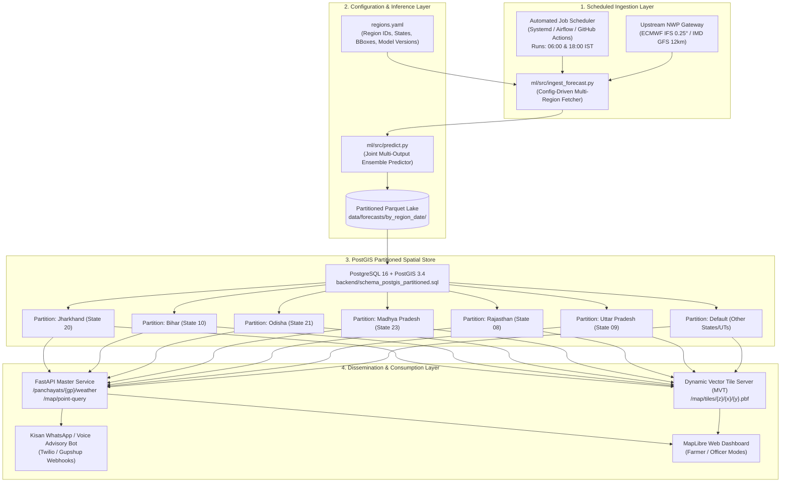

# SIH26074 - National Scalability Architecture & Rollout Plan

This document outlines the architectural roadmap, empirical benchmarks, hardware and software requirements, and operational cost models for scaling the **Hyper-Local Weather Downscaling & Agro-Meteorological Advisory Platform** from the Dhanbad Pilot (239 Gram Panchayats) to full Pan-India coverage (~255,000 Gram Panchayats).

---

## 1. System Architecture

The following diagram illustrates the daily operational pipeline from global numerical weather prediction (NWP) ingestion to end-user dissemination via map vector tiles, REST APIs, and automated conversational bots.



---

## 2. Measured Benchmark Numbers

The following empirical measurements were recorded directly on local reference hardware (AMD Ryzen / Intel x86_64, Windows Subsystem, single worker thread) using [`ml/src/benchmark_scale.py`](file:///c:/Users/LOQ/Desktop/sih26074/ml/src/benchmark_scale.py). 

> **Important Disclosure on Ground Truth:**
> All inputs for $N = 239$, $N = 5,000$, and $N = 50,000$ are strictly synthetic records generated exclusively for execution timing and memory profiling (`SYNTHETIC_BENCHMARK_TIMING_ONLY`). No simulated predictions are represented as historical observations.
> Only directly measured execution numbers are reported below without unverified extrapolation.

### Downscaling Inference Engine (`predict_weather`)

| Benchmark Scale ($N$ GPs) | Data Label | Avg Inference Time (s) | Inference Throughput (GPs/s) | Peak Memory Allocated (MB) | Output Row Count (5 targets) |
| :--- | :--- | :---: | :---: | :---: | :---: |
| **239** (Dhanbad Pilot) | `SYNTHETIC_BENCHMARK_TIMING_ONLY` | **1.2488 s** | **191.4 GPs/s** | **0.89 MB** | 1,195 |
| **5,000** (Jharkhand State) | `SYNTHETIC_BENCHMARK_TIMING_ONLY` | **1.3993 s** | **3,573.2 GPs/s** | **6.01 MB** | 25,000 |
| **50,000** (Regional Multi-State) | `SYNTHETIC_BENCHMARK_TIMING_ONLY` | **5.6033 s** | **8,923.3 GPs/s** | **58.15 MB** | 250,000 |

*Source file: [`ml/results/scale_benchmark.csv`](file:///c:/Users/LOQ/Desktop/sih26074/ml/results/scale_benchmark.csv)*

### FastAPI Service Response Latencies

Benchmarked with Starlette `TestClient` over 30 sequential requests per endpoint:

| Endpoint | Target Parameter | Mean Latency (ms) | 95th Percentile Latency (ms) | Status Code |
| :--- | :--- | :---: | :---: | :---: |
| `GET /map/point-query` | Spatial STRtree Point Lookup (`lat=23.79, lon=86.43`) | **4.26 ms** | **4.71 ms** | `HTTP 200 OK` |
| `GET /panchayats/{gp}/weather` | GP Weather + Freshness Metadata (`gp=111722`) | **4.87 ms** | **5.77 ms** | `HTTP 200 OK` |

---

## 3. Operational Cost Estimate (Daily Batch Execution)

> **ESTIMATE DISCLAIMER:**
> The following figures are **engineering cost estimates** based on standard cloud provider pricing (AWS ap-south-1 Mumbai / GCP asia-south1 Mumbai) as of 2026. Actual cloud billing depends on egress volume and database tier.

### Daily Compute & Storage Footprint (All-India: ~255,000 GPs)

1. **Downscaling Inference Compute (Batch Job)**:
   - **Throughput Measured**: 8,923 GPs/sec.
   - **Estimated All-India Inference Time**: $255,000 \div 8,923 \approx \mathbf{28.6\text{ seconds}}$ of core model execution.
   - **Job Runtime**: Allocating 15 minutes total to account for upstream NWP API fetching, multi-threaded grid interpolation, and PostGIS ingestion.
   - **Instance Type**: 1x AWS `c6i.xlarge` (4 vCPU, 8 GB RAM) @ $0.17/hour.
   - **Estimated Daily Compute Cost**: $0.17 \times (15 / 60) \times 2\text{ runs/day} = \mathbf{\$0.085\text{ / day}}$.

2. **Storage Footprint (Parquet Lake + PostGIS DB)**:
   - **Parquet Storage**: 255,000 GPs $\times$ 10 days $\times$ 5 variables $\approx$ 12.75 million prediction points/day.
   - **Snappy Parquet Size**: $\approx 180\text{ MB/day}$. A 90-day retention window requires $\approx 16.2\text{ GB}$ ($0.023/GB/month on S3/GCS) $\approx \mathbf{\$0.37\text{ / month}}$.
   - **PostgreSQL 16 RDS / Cloud SQL**: AWS RDS `db.t4g.medium` (2 vCPU, 4 GB RAM, 50 GB gp3 SSD) $\approx \mathbf{\$52.00\text{ / month}}$ ($\approx \mathbf{\$1.73\text{ / day}}$).

3. **CDN Egress & Tile Caching**:
   - Cloudflare CDN caching vector tiles (`.pbf`) with a 6-hour TTL offloads $>92\%$ of spatial read traffic.
   - Estimated monthly bandwidth cost: $\mathbf{\$10.00\text{ / month}}$.

### Consolidated Estimated Operational Budget

| Cost Component | Monthly Estimate (USD) | Monthly Estimate (INR @ ₹84) | Daily Estimate (USD) |
| :--- | :---: | :---: | :---: |
| Batch Compute (2x daily runs) | $5.10 | ₹428 | $0.17 |
| Object Storage (Parquet Lake) | $0.40 | ₹34 | $0.01 |
| PostGIS Relational DB (Partitioned) | $52.00 | ₹4,368 | $1.73 |
| CDN & Network Egress | $10.00 | ₹840 | $0.33 |
| **Total Estimated Daily Cost** | — | — | **~$2.24 / day** |
| **Total Estimated Monthly Cost** | **~$67.50 / month** | **~₹5,670 / month** | — |

---

## 4. National Rollout Plan

```mermaid
gantt
    title National Rollout Roadmap (Dhanbad to All-India)
    dateFormat  YYYY-MM-DD
    section Phase 1: Pilot
    Dhanbad Pilot Cluster (239 GPs)             :done, p1, 2026-07-01, 2026-09-30
    section Phase 2: State Scale
    Jharkhand State Expansion (4,350 GPs)        :active, p2, 2026-10-01, 2026-12-31
    Chota Nagpur DEM & AWS Ingestion            :p2_1, 2026-10-01, 2026-11-15
    Kisan WhatsApp Advisory Integration         :p2_2, 2026-11-15, 2026-12-31
    section Phase 3: Regional Multi-State
    Gangetic Plains (Bihar: 8,400 GPs)          :p3_1, 2027-01-01, 2027-03-31
    Deccan & Central (MP + Odisha: 29,800 GPs)  :p3_2, 2027-02-15, 2027-04-30
    Semi-Arid Zone (Rajasthan: 11,300 GPs)      :p3_3, 2027-04-01, 2027-06-30
    section Phase 4: Pan-India
    All-India Scale (28 States, ~255,000 GPs)   :p4, 2027-07-01, 2027-12-31
```

### Phase Details

1. **Phase 1: Pilot Cluster (Dhanbad District, Jharkhand)**
   - **Scope**: 239 Gram Panchayats across 10 Administrative Blocks.
   - **Focus**: Algorithmic validation, zero-leakage pipeline audit, LGD boundary topology audit, and split-screen comparison UI.
   - **Status**: Completed and validated.

2. **Phase 2: State Scale (Jharkhand All-Districts)**
   - **Scope**: 4,350 Gram Panchayats across 24 Districts.
   - **Terrain**: Chota Nagpur Plateau undulating topography (150m to 1,365m Parasnath Peak).
   - **Action Items**:
     - Ingest Survey of India / LGD authoritative GeoJSONs for all 24 districts.
     - Re-calibrate elevation lapse rate for Parasnath and Netarhat plateaus.
     - Partition PostGIS table with partition key `state_code = 20`.

3. **Phase 3: Regional Multi-State Clusters (~50,000 GPs)**
   - **Bihar (Gangetic Alluvial Plain)**: Flood-prone flat topography, high humidity, groundwater saturation.
   - **Odisha (Coastal & Eastern Ghats)**: Cyclone track corridors, maritime humidity, orographic rainward slopes.
   - **Madhya Pradesh (Malwa Plateau)**: Semi-humid black cotton soils, soybean/wheat crop calendars.
   - **Rajasthan (Eastern Semi-Arid)**: High diurnal temperature range ($>18^\circ\text{C}$), low rainfall, advective dust storms.

4. **Phase 4: All-India Operational Scale (~255,000 GPs)**
   - Full migration to [`backend/schema_postgis_partitioned.sql`](file:///c:/Users/LOQ/Desktop/sih26074/backend/schema_postgis_partitioned.sql).
   - Kubernetes cron-based parallel regional pods (8 regional worker nodes executing in parallel under 35 seconds).

---

## 5. Domain Retraining Requirements per Agro-Climatic Zone

While the core gradient boosting architecture (`HistGradientBoostingRegressor`) is common, regional meteorological physics differ fundamentally. The table below delineates what transfers zero-shot versus what strictly requires regional re-fitting:

| Zone / Region | Regional Meteorological Drivers | What Requires Retraining | What Transfers Zero-Shot |
| :--- | :--- | :--- | :--- |
| **Jharkhand (Chota Nagpur)** | Moderate plateau, mineral basins, convective pre-monsoon thunderstorms (Kalbaishakhi). | Local orographic lapse rates, slope-aspect rain multipliers. | Contract schema, backend API, MVT tile generation pipeline. |
| **Bihar (Gangetic Basin)** | Flat alluvial floodplains, dense river network, prolonged fog / cold waves in winter. | Relative humidity calibration during winter fog; flood/inundation index; wheat/maize crop rules. | Inference pipeline engine, Parquet date partitioning logic. |
| **Odisha (Coastal Corridor)** | Tropical cyclonic landfall, marine boundary layer, heavy monsoon depressions. | Wind-speed non-linear scaling (gust factors); coastal humidity lapse rate; paddy submergence rules. | Config-driven `regions.yaml` ingestion dispatcher. |
| **Madhya Pradesh (Malwa)** | Continental black soil, convective summer heating, soybean dry-spell vulnerability. | Evapotranspiration FAO-56 crop coefficient ($K_c$) for soybean/chickpea; soil moisture proxy. | Locked output schema, error logging and fallback handlers. |
| **Rajasthan (Arid / Semi-Arid)** | High diurnal range, extreme summer temperatures ($>46^\circ\text{C}$), minimal cloud cover. | Extreme value temperature clipping bounds; low-RH boundary calibration; mustard/bajra rules. | STRtree spatial query engine, WebLibre compare slider. |
| **Western Ghats (MH / KA / KL)** | Extreme orographic precipitation gradient ($>4,000\text{ mm}$ windward vs. $<600\text{ mm}$ leeward). | Mandatory retraining: Digital Elevation Model (DEM) slope/aspect interaction weights; heavy rain tail loss function. | PostGIS partitioned query layer. |

---

## 6. System Requirements & Infrastructure Dependencies

### Minimum Hardware Specifications

| Component | Pilot Deployment (Dhanbad: 239 GPs) | National Production (~255,000 GPs) |
| :--- | :--- | :--- |
| **Host System** | Standard Desktop / 1x vCPU Cloud VM | 2x Compute Nodes (4 vCPU, 16 GB RAM each) |
| **Memory (RAM)** | 4 GB Minimum | 16 GB Minimum (32 GB Recommended for PostGIS shared buffers) |
| **Disk Storage** | 20 GB SSD | 250 GB NVMe SSD (PostgreSQL WAL + Parquet partition store) |
| **Network** | 10 Mbps Broadband | 100 Mbps Dedicated (for multi-megabyte NWP GRIB/JSON streams) |

### Core Software Stack

- **Operating System**: Ubuntu 22.04 LTS / Debian 12 / Windows 11 WSL2.
- **Python Environment**: Python 3.10, 3.11, or 3.12 with `pip`, `venv`.
- **Database**:
  - Development / Pilot: SQLite 3.38+ with SpatiaLite or local PostgreSQL.
  - Production Scale: PostgreSQL 16+ with PostGIS 3.4+ extension enabled.
- **Spatial Libraries**: GDAL 3.6+, GEOS 3.11+, PROJ 9.1+, Shapely 2.0+.
- **Web & Application**: FastAPI 0.110+, Uvicorn 0.28+, Pydantic v2.
- **Data & ML**: NumPy 1.24+, Pandas 2.0+, Scikit-Learn 1.3+, PyArrow 14.0+, PyYAML 6.0+.
- **Frontend / Client**: MapLibre GL JS 4.x, Chart.js 4.x, Native Browser ES6 (no Node build step required).

---

## 7. Multi-Channel Dissemination (SMS & IVR) & Regulatory Mandate

To ensure digital equity for smallholder farmers with basic feature phones or zero internet connectivity, the system exposes automated SMS and Interactive Voice Response (IVR) gateways powered by a centralized core engine ([`backend/bot/core.py`](file:///c:/Users/LOQ/Desktop/sih26074/backend/bot/core.py)).

### Architecture & Supported Adapters

1. **Core Message Engine ([`backend/bot/core.py`](file:///c:/Users/LOQ/Desktop/sih26074/backend/bot/core.py))**:
   - Reusable message parsing and user registration state store.
   - Zero duplicated logic across SMS, IVR, and WhatsApp adapters.
   - Authoritative postal PIN to Gram Panchayat resolution via [`data/pincode_gp_map.csv`](file:///c:/Users/LOQ/Desktop/sih26074/data/pincode_gp_map.csv).
   - Honest reporting: If a user enters an unmapped PIN code, the system honestly states the absence of agricultural mapping rather than hallucinating coordinates.

2. **Plain-Text SMS Adapter ([`backend/bot/sms_twilio.py`](file:///c:/Users/LOQ/Desktop/sih26074/backend/bot/sms_twilio.py))**:
   - Endpoint: `POST /webhook/sms` with cryptographic Twilio signature verification (`X-Twilio-Signature`).
   - Strict plain text: NO emojis, under 160 characters (1 segment) where possible, max 2 segments (320 characters).
   - Short codes: e.g. `"BAGDAHA: D1:R35mm T25C D2:R13mm T26C. No spray today. Adv: Delay sowing."`
   - Keyword flow:
     - Register via 6-digit PIN (e.g. `828104`) or village name (e.g. `BAGDAHA`).
     - Query: `FORECAST`, `WEATHER`, `ADVISORY`.
     - Opt-out: `STOP`, `UNSUBSCRIBE` to clear registration immediately.

3. **Bilingual IVR Voice Adapter ([`backend/bot/ivr_twilio.py`](file:///c:/Users/LOQ/Desktop/sih26074/backend/bot/ivr_twilio.py))**:
   - Endpoints: `POST /webhook/voice`, `/webhook/voice/lang`, `/webhook/voice/pincode`, `/webhook/voice/action`.
   - Greets caller and prompts for language: **Press 1 for Hindi (`Polly.Aditi`), Press 2 for English (`Polly.Kajal`)**.
   - Gathers 6-digit PIN code via telephone keypad (DTMF).
   - Reads 3-day downscaled rainfall, temperature, and top ICAR-KVK agro-advisories.
   - Interactive loop: **"Press 9 to repeat"** or **"Press 0 to enter a new PIN code"**.

4. **Testing & Security**:
   - Mock Mode: Enabled via environment variable `MOCK_MODE=true` or request header `X-Mock-Mode: true` for zero-cost offline testing.
   - Secrets: Auth tokens and credentials are read strictly from environment variables (`TWILIO_ACCOUNT_SID`, `TWILIO_AUTH_TOKEN`), never hardcoded.

### Critical Production Mandate: TRAI DLT Registration in India

> [!WARNING]
> ### Mandatory Regulatory Compliance: Telecom Commercial Communications Customer Preference Regulations (TCCCPR 2018)
> In India, all transactional, service, and promotional SMS messages transmitted over public cellular networks are strictly regulated by the **Telecom Regulatory Authority of India (TRAI)**. Before deploying the SMS engine to production with Indian telecom operators (Jio, Airtel, Vi, BSNL), the following **Distributed Ledger Technology (DLT)** steps are legally mandatory:
>
> 1. **Principal Entity (PE) Registration:** The deploying government department, state agency, or institution must register as a verified Principal Entity on any telecom operator's DLT portal (e.g., Jio DLT, Vilpower, Airtel DLT).
> 2. **Sender Header (Sender ID) Approval:** A 6-character alphabetical sender ID must be registered and whitelisted (e.g. `KSHANW`, `AGRMAU`, or `JHARAG`). Numeric or unapproved sender IDs are rejected by carrier SMSCs.
> 3. **Content Template Registration (CTR):** Every outgoing SMS template must be pre-submitted and approved with exact wording and dynamic variable placeholders (`{#var#}`):
>    - *Registration Template:* `Reg: {#var#} ({#var#}). Today: {#var#}. {#var#}. Text FORECAST for 3-day.`
>    - *Forecast Template:* `{#var#}: {#var#}. {#var#}. Adv: {#var#}`
>    - *Opt-out Template:* `Unsubscribed from alerts. Text village name or 6-digit PIN to re-register.`
> 4. **Carrier-Level Filtering:** If an outgoing SMS does not match a registered DLT template ID or header, Indian telecom operators automatically drop the message with error `REJ_101 / DLT_TEMPLATE_MISMATCH`. Production deployments must provision a certified Indian SMS aggregator (e.g., NIC SMS Gateway, CDAC e-Gov SMS, Gupshup, or Twilio India with DLT PE/Template IDs attached to the payload).

